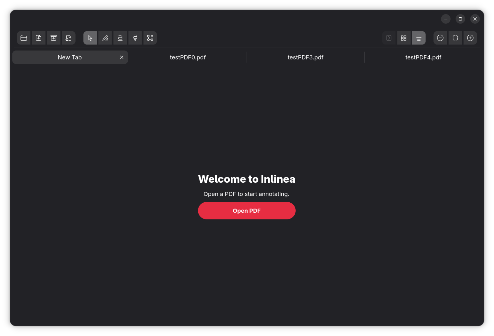
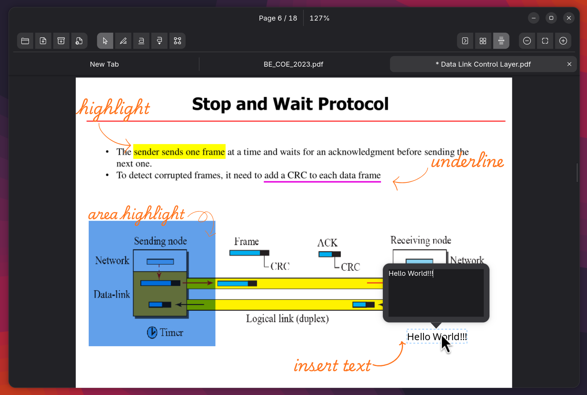

#  Inlinea

A native PDF reader and annotation tool for Linux, built with Python, GTK 4, and Libadwaita.

I couldn’t find a PDF editor on Linux that felt clean and fast for annotation. Most tools were either powerful but clunky, or simple but missing basic workflows, so I started building one.
Inlinea is meant to be fast, minimal and just work - open a PDF, highlight stuff, add notes, save, done.

<p align="center">
  
  
</p>

## What it does

- **Draggable tabs**   
 pull a tab out into its own window, drag it back to merge. Browser-style.
- **Session restore**   
remembers every open file, scroll position, zoom level, and active tab across restarts.
- **Crash recovery**   
detects unclean shutdowns and brings back your full workspace on relaunch.
- **Native PDF annotations**   
highlights, underlines, text notes, area selections. Saved as standard PDF markup, no sidecar files.
- **Flattened export**   
burns annotations into the page layout for sharing with anyone, regardless of their reader.
- **Text formatting**   
  - bold
  - italic
  - underline
  - font picker on text annotations. Full undo/redo for everything.
- **Virtual scroll**   
pages load and unload as you scroll. 500-page PDFs stay snappy.
- **Focal-point zoom**   
Ctrl+Scroll and pinch zoom into where your cursor is, not the center of the screen.

## Getting Started

### Dependencies

You'll need GTK 4, Libadwaita, Poppler, Cairo, and PyMuPDF installed.

### Arch Linux (AUR)

```bash
yay -S inlinea
```
**Fedora / RHEL:**
```bash
sudo dnf install \
  gtk4-devel libadwaita-devel python3-gobject \
  python3-cairo poppler-glib-devel cairo-devel python3-pymupdf
```

**Ubuntu / Debian:**
```bash
sudo apt install \
  libgtk-4-dev libadwaita-1-dev python3-gi python3-cairo \
  libgirepository1.0-dev libpoppler-glib-dev gir1.2-poppler-0.18 python3-pymupdf
```

### Install & Run

```bash
git clone https://github.com/kaurmanjot20/inlinea.git
cd inlinea

# Run directly from source
python3 -m inlinea
```

**Arch Linux:**

```bash
sudo pacman -S gtk4 libadwaita python-gobject python-cairo poppler-glib python-pymupdf
git clone https://github.com/kaurmanjot20/inlinea.git
cd inlinea

# Run directly from source
python3 -m inlinea
```

### Desktop Integration (Right-click "Open With" support)

If you are running from source and want to be able to double-click PDFs or right-click to "Open With -> Inlinea" in your system file manager, simply run the desktop integration script:

```bash
bash install-desktop.sh
```

This will automatically create a local executable wrapper in `~/.local/bin/` and register the `.desktop` shortcut with your system.

## Contributing

Contributions are welcome - whether it's a bug fix, a new feature, or just cleaning something up. Check out the [Contributing Guidelines](CONTRIBUTING.md) for how to get started.

All PRs go through review before merging. Please open an issue first if you're planning something big so we can discuss the approach.

## License

MIT - see [LICENSE](LICENSE) for details.
