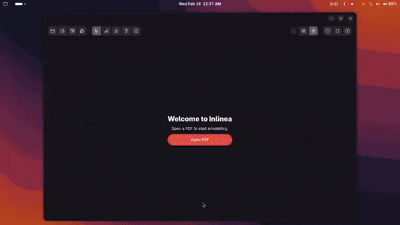

#  Inlinea

A Linux-first, annotation-focused PDF editor built with Python, GTK 4, and Libadwaita.

**UX-first. Native. Clean.**

## Features

- Browser-style tabs for multi-document editing
- Text highlights and underline annotations
- Area highlights with color customization
- Add-text-anywhere with inline editing
- Undo / Redo support
- Dual-page and continuous scroll view modes
- Embedded PDF annotation saving (no sidecar files)
- Flattened PDF export
- Thumbnail sidebar with lazy rendering
- Pinch-to-zoom and Ctrl+scroll zoom

## Screenshots

<p align="center">
  
</p>

<p align="center">
   
  
</p>

## Setup & Installation

Inlinea depends on GTK 4, Libadwaita, Poppler, Cairo, and PyMuPDF.

### Fedora / RHEL

```bash
sudo dnf install \
  gtk4-devel \
  libadwaita-devel \
  python3-gobject \
  python3-cairo \
  poppler-glib-devel \
  cairo-devel \
  python3-pymupdf
```

### Ubuntu / Debian

```bash
sudo apt install \
  libgtk-4-dev \
  libadwaita-1-dev \
  python3-gi \
  python3-cairo \
  libgirepository1.0-dev \
  libpoppler-glib-dev \
  gir1.2-poppler-0.18 \
  python3-pymupdf
```

## Running Locally

```bash
python3 main.py
```

## Register as PDF Handler

Add Inlinea to your system's "Open With" menu:

```bash
bash install-desktop.sh
```

This copies a `.desktop` entry to `~/.local/share/applications/` so you can right-click any PDF and open it with Inlinea.


## License

MIT License
