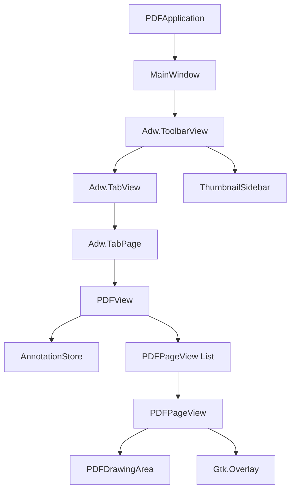

# Architecture & Implementation Guide

This document provides a comprehensive technical overview of the Linux PDF Editor application. It details the system architecture, feature implementations, data flow, and future roadmap.

## 1. System Overview

The application is a **native Linux PDF Annotation tool** built using **Python**, **GTK 4**, and **Libadwaita**. It follows a modern GNOME design pattern, leveraging `Adw.ApplicationWindow`, `Adw.ToolbarView`, and `Adw.TabView` for a tabbed, responsive interface.

### Core Technologies
*   **UI Framework**: GTK 4 + Libadwaita (for adaptive UI and widgets).
*   **PDF Backend**: `poppler-glib` (via `gobject-introspection`) for parsing and rendering PDF pages.
*   **Rendering**: Cairo (used for both PDF page rendering and custom annotation drawing).
*   **Language**: Python 3.

## 2. Architecture Layout

The application follows a hierarchical component structure:

### Component Roles

*   **`PDFApplication` (`app.py`)**: Entry point. Handles GTK application lifecycle, global actions, and CSS loading.
*   **`MainWindow` (`window.py`)**: The primary container.
    *   Manages the `Adw.Tabbar` and `Adw.TabView` for multi-document support.
    *   Handles the Global Ribbon (Tools, Zoom, IO actions).
    *   Coordinates the Sidebar (thumbnails) which is contextual to the active tab.
*   **`PDFView` (`ui/pdf_view.py`)**: The "Controller" for a single open document.
    *   Manages a ScrollView containing the vertical stack of pages.
    *   Handles **Zoom** logic (Pinch/Ctrl+Scroll) and coordinate transformations.
    *   Manages View Modes: Continuous vs. Paged, Single vs. Dual Page layout.
    *   Owns the `AnnotationStore` for the specific document.
*   **`AnnotationStore` (`document/store.py`)**: The Data Model.
    *   In-memory list of `Annotation` objects (dataclass).
    *   Implements the **Undo/Redo Stack** (Command Pattern).
    *   Handles JSON serialization/deserialization.
    *   Tracks "Dirty" state for unsaved changes.
*   **`PDFPageView` (`ui/page_view.py`)**: Represents a single page.
    *   Wraps the rendering of the PDF page image.
    *   Contains the `PDFDrawingArea` overlay.
*   **`PDFDrawingArea` (`ui/pdf_drawing_area.py`)**: The presentation layer for annotations.
    *   Uses Cairo to draw annotations on top of the PDF image.
    *   Handles mouse/touch events for creating and selecting annotations.

## 3. End-to-End Feature Implementation

### 3.1 PDF Loading & Rendering
*   **Loading**: `document/loading.py` uses `Poppler.Document.new_from_file`.
*   **Rendering**: `document/render.py` renders Poppler pages to Cairo surfaces. These are cached or rendered on demand in `PDFPageView`.
*   **Async**: Loading can be offloaded to prevent UI friezes (though currently mostly synchronous for simplicity in prototype).

### 3.2 Annotation System
*   **Data Model**: Annotations are defined in `store.py` as `Annotation` objects with:
    *   `type`: 'highlight', 'underline', 'text'
    *   `rects`: List of (x, y, w, h) in PDF coordinate space (Points).
    *   `content`: Text content (for notes/text boxes).
    *   `color`: RGBA tuple.
*   **Creation Flow**:
    1.  User selects tool in `MainWindow` Ribbon -> calls `PDFView.set_tool()`.
    2.  `PDFView` propagates tool state to all `PDFPageView`s.
    3.  User drags on `PDFDrawingArea`.
    4.  `PDFDrawingArea` captures input, calculates coordinates relative to the PDF Page.
    5.  On drag end, a new `Annotation` is created and added to `AnnotationStore.add()`.
    6.  `store.add()` pushes to Undo Stack and emits `is_dirty`.
    7.  `PDFPageView` listens to changes and triggers `queue_draw()`.
*   **Drawing**:
    *   `PDFDrawingArea.on_draw()` iterates over `store.get_for_page(page_index)`.
    *   It sets up a Cairo context.
    *   **Highlight**: Draws rectangles with `CAIRO_OPERATOR_MULTIPLY` for transparent marker effect.
    *   **Underline**: Stroked lines at the bottom of the rect.
    *   **Text**: Renders PangoLayout at the rect position.

### 3.3 Persistence (Sidecar JSON)
*   **Strategy**: Non-destructive. The original PDF is **never modified** during normal saves.
*   **Storage**: A `.json` file is created next to the PDF (e.g., `doc.pdf.json`).
*   **Linking**: The JSON contains a **Fingerprint** (hash of first 4KB + file size) to ensure annotations match the specific PDF version.
*   **Format**: JSON generic structure, effectively dumping the `Annotation` dataclasses.

### 3.4 Undo/Redo
*   Implemented in `AnnotationStore`.
*   Stacks: `_undo_stack` and `_redo_stack`.
*   Operations recorded: `('add', annotation)`, `('remove', annotation)`, `('modify', id, old_rects)`.
*   When `undo()` is called, the inverse operation is performed (e.g., `add` -> removes object from list) and pushed to Redo stack.

### 3.5 Zoom & Layout
*   **Zoom**: Implemented in `PDFView`.
    *   Uses a `custom_scale` factor.
    *   On Zoom, it calls `child.update_scale(scale)` on all pages.
    *   Pages resize their generic widgets (Gtk.Image/DrawingArea).
    *   **Smart Scrolling**: The `_zoom_around_focal` method ensures the view stays centered on the mouse cursor or pinch center during zoom.
*   **Layout Modes**:
    *   **Continuous**: Access via `Gtk.ScrolledWindow` (vertical box).
    *   **Dual Page**: `PDFView.relayout_pages()` repacks the `page_box` to use horizontal rows containing 2 pages each.

### 3.6 Export
*   **Logic**: `document/export.py`.
*   **Process**:
    1.  Create a new PDF Surface (Cairo) for the target file.
    2.  Iterate through all pages of the source PDF.
    3.  Render source Page to the new Surface.
    4.  Draw all annotations from `AnnotationStore` onto the Surface (burning them in).
    5.  Save/Finish the surface.
*   **Result**: Valid standard PDF with visible annotations (flattened, not editable objects).

## 4. Expected Behavior

*   **Performance**: Scroll should be smooth. Page rendering is cached where possible.
*   **Visuals**:
    *   Highlights should look like marker pen (multiply blend).
    *   Hovering over annotations (in Select mode) should show a bounding box or resize handles (future).
*   **Safety**:
    *   Closing the window with unsaved changes prompts a dirty check (via `on_close_request` checking `store.is_dirty`).
    *   Tabs show `*` when dirty.

## 5. Future Work / To-Do

The following features are planned or arguably missing from the current architecture:

### Missing / In-Progress
*   **Selection & transform**: The logic to Select an existing annotation and Move/Resize it is partially scaffolded but needs robust `HitTest` and `DragHandle` implementation in `PDFDrawingArea`.
*   **Text Editing**: Currently creates new text. Editing existing text requires a "Double Click" action to spawn the `TextEditor` popover with existing content.
*   **Form Filling**: No support for AcroForms. Requires Poppler Input integration.
*   **Sticky Notes**: Pop-up notes (standard PDF annotation model) are not implemented (only on-page text).

### Architecture Improvements
*   **Async Rendering**: Move page rendering to a background thread to prevent UI stutter on large files.
*   **Virtual List**: `PDFView` currently instantiates Widgets for ALL pages. For 500+ page documents, this needs a `Gtk.ListView` or custom recycling mechanism (Virtualization) to only render visible pages.
*   **Standard PDF Annotation Sync**: Currently we save to JSON. True PDF Editor behavior would be to write standard PDF Annotations (Link, Highlight, FreeText) directly into the PDF file structure using Poppler's writing API, acting as a true editor rather than a sidecar viewer.

